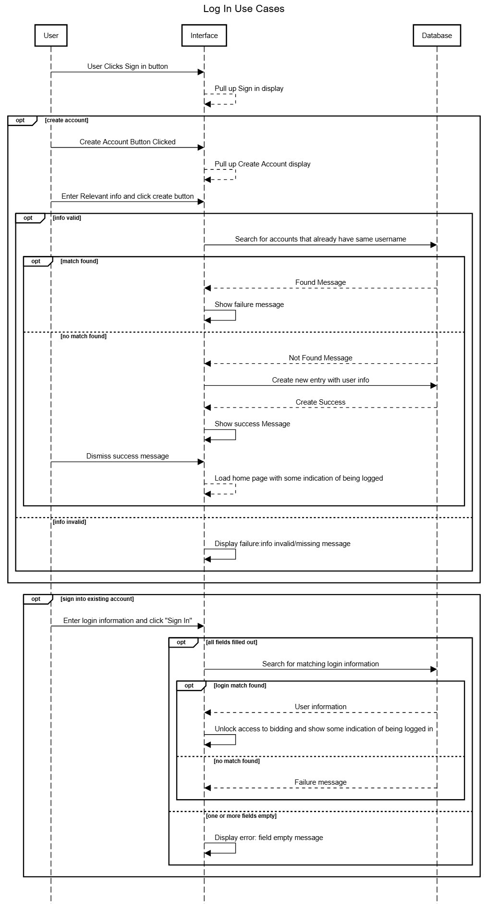
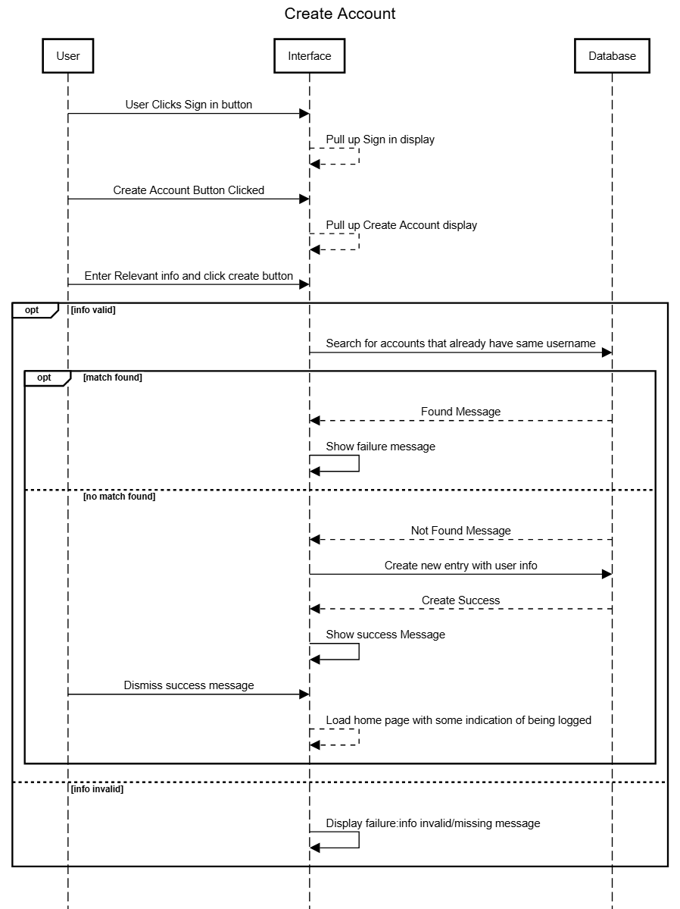
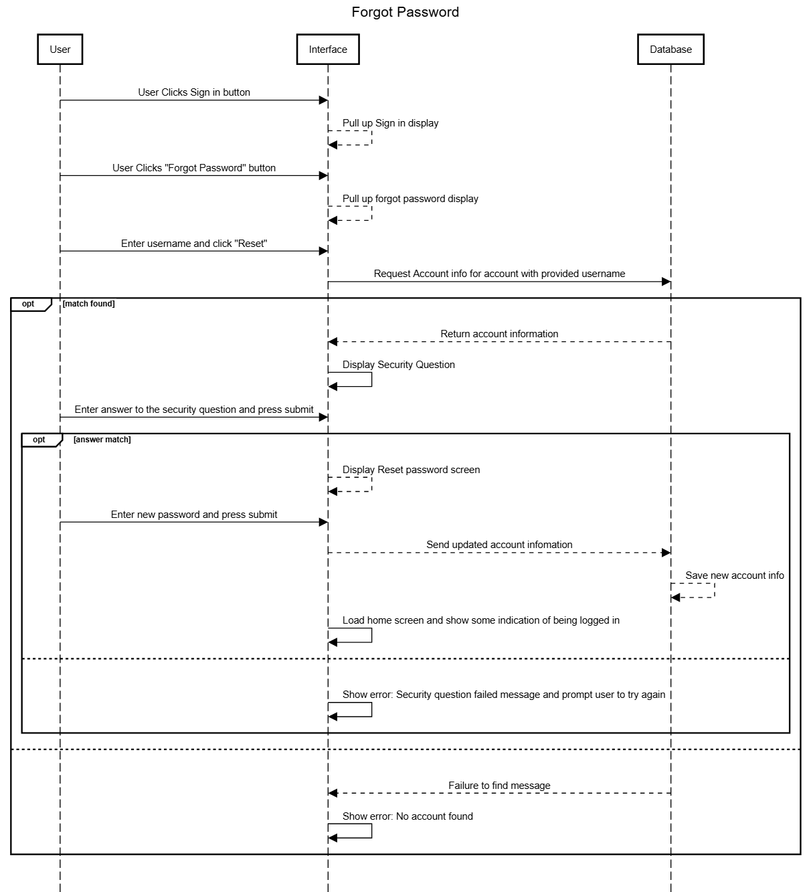
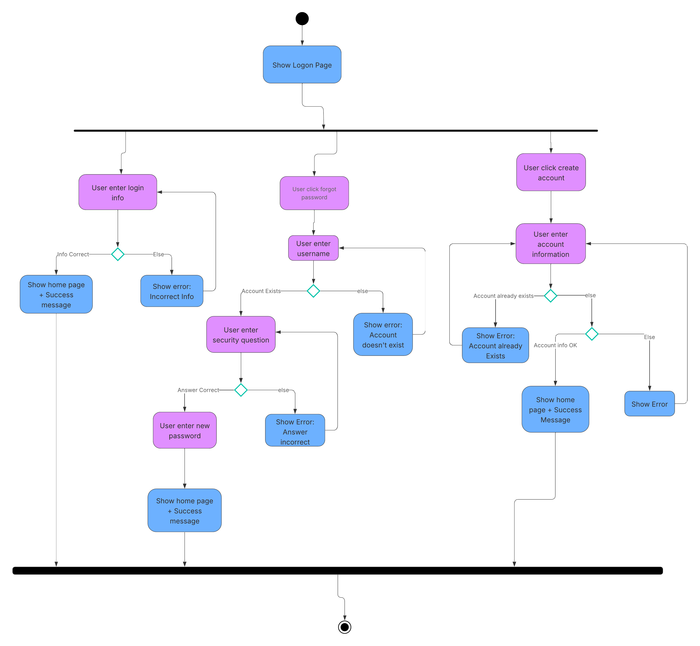
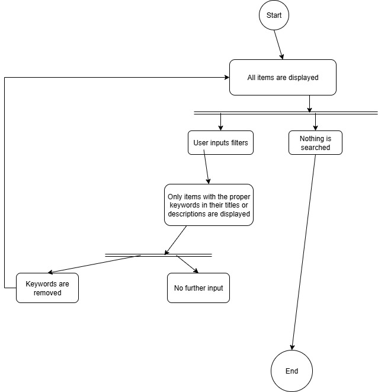
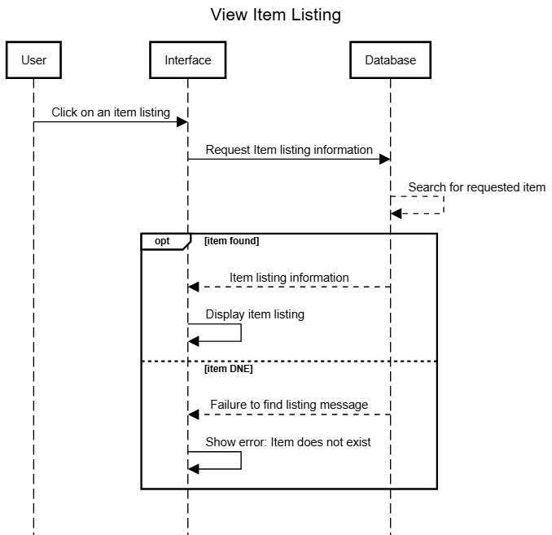
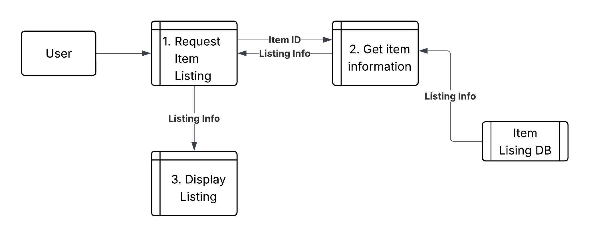
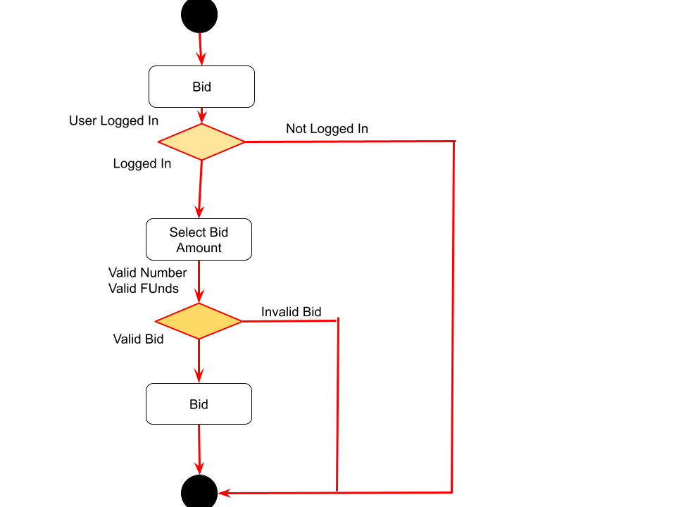

# System Requirements

## 1. Each user has account and can be authenticated/logged in.
### Use Cases
- Sign in: Log into an existing account. MongoDB database is checked for the login. If username & pw matches some username & pw combination in MongoDB, "log in" and allow access to bidding on auctions. 

- Sign up: Enter new account details (username, email, password, confirm password, security question). Account added to MongoDB database. "Log in" and allow access to bidding on auctions. 

- Forgot password: Reset password. User must provide their username and answer their security question (retrieved from the MongoDB database) successfully to be able to create a new password. If the user fails to answer their security question, they will not be able to reset their password. 

## Activity Diagram

## 2. All users can add an auction item: include a description, title, and date/time the auction should end.
### Use Cases
- List Item: Small form pops up on user click, allowing for addition of relevent photos, and details
- Description: Description of the item located underneath the pictures, letting buyers see what the item is
- Title: Text that will be displayed larger beneath the pictures, and the name that will appear on other pages
- Date/Time: Date and Time of the end of the auction. Date selected first, then option for time of day. Will be represented by a countdown on each item page. Countdown will be based on the EST timezone where the server is located.
### Use Case Descriptions and Diagrams

## 3. All users should be able to see all active auctions.
### Use Cases
- On the main page, all items will be displayed in a column based on order added.
- There will be an option to filter items based on specific criteria input by the user so that the user can find specific items of interest.
### Use Case Descriptions and Diagrams
- The user intputs their desired item into a search bar
- This query will access the databse containing all items currently for auction
- From here it will begine to check each specific item to see if its name or description contain the keyword
- All items that contain said keyword will be displayed

## 4. All users should be able to click on an active auction.
### Use Cases
- View Auction: Pulls up page of respective auction. Gets the information about the listing from a MongoDB database. 

## 5. After selecting an active auction, the user should be sent to a page with the title and description of the item, a real-time countdown to the end of the auction, the ability to bid with tokens, and a real-time bid history.
### Use Cases
- Bid on Auction: Pulls up menu for user to place bids. Must be more than highest bid.
- View bid history: Shows history of bids, featuring user and amount bidded.
### Use Case Descriptions and Diagrams

